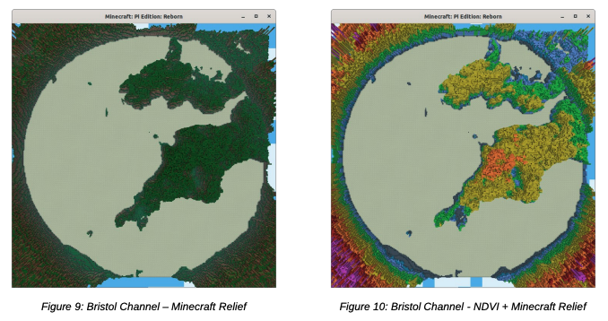
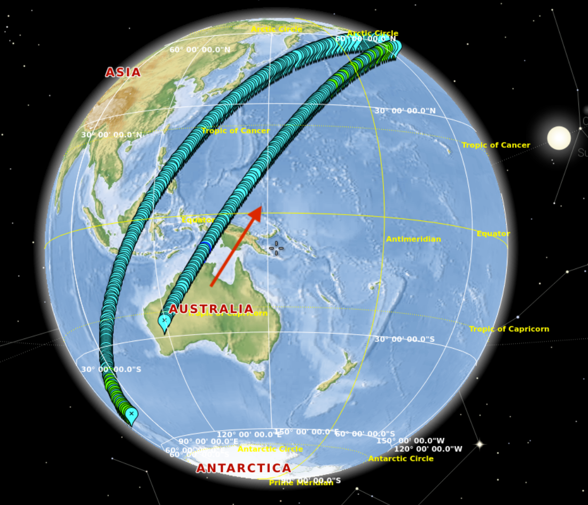

## Develop your idea

In this step, you will develop your idea and create your hypothesis. 

A **hypothesis** is an assumption based on limited evidence. Your hypothesis will be the predicted answer you expect for your research idea. A clearly written hypothesis will help you focus your experiment and write your report. 

### Develop a research question

--- task ---

Start by thinking about a research question. You could create a list of possible questions and then choose one to focus your experiment on. 

**Tip:** Choose topics that interest you. You don't need to be an expert on the topic, but having an interest will help you create an engaging experiment. 

{:width="400px"}

To start, you could:

+ Think about what you would like to know about 'Life in space' or 'Life on Earth'. Then ask yourself "Is it possible to answer that question with the Astro Pi and its sensors and camera?"
+ Research what interesting things you could investigate using the Astro Pi and its sensors and camera.
+ Investigate what machine learning or artificial intelligence techniques you could apply to available data from the Astro Pi and its sensors and camera. 

**Tip:** ⏱️ Try to set reasonable expectations of what is possible in the time you have available. You might have an amazing idea, but do you have the time to get it to work?

**A quote from a 2021/22 winner:** "One of our biggest failures was the lack of coordination of time, which meant that we had very little time to analyse the data and work on the project. We should therefore better coordinate time with the help of platforms like Trello for future projects." 

--- /task ---

### Focus your research question 

--- task ---

To use your question as a basis for your hypothesis, it must be focused, precise, and answerable. 

You could ask:

+ What is the relationship between x and y? 
+ How has x changed over time? 
+ What are the characteristics of x?
+ What is the impact of x on y?

Or your question could be something else.

--- /task ---

### Basic research

It is crucial that your team understands the limitations of the Astro Pi hardware and what you’re not allowed to do in your experiment. Your idea must fulfil the criteria in the following checklist, otherwise your idea may be disqualified.

+ Your experiment can not rely on astronaut interaction. We can’t be sure when an astronaut will be around the Astro Pis, and they have their own busy working schedule.
+ Your experiment should not be a game. It must be a scientific experiment.
+ Real-time communication with the Astro Pis on the ISS is not possible, because we don’t have a radio communication module to be able to ‘give instructions’ from Earth.
+ Don’t expect your experiment to run at a specific date, time, or location. We can’t predict accurately when each experiment will run.

--- task ---

**Think:** Can your question be answered within the mission constraints?

Here are some common constraints that impact or stop success:
+ 🌍 The ISS orbital path restrictions mean there are some places the ISS does not travel over &mdash; you cannot look at the Earth's poles for example.
+ 💧 The Earth's surface is 70% water &mdash; statistically speaking, many of your photos will be of seas and oceans.
+ ☁️ Cloud cover might obscure your target.
+ 🌍 During your experiment the ISS will not pass over the same place twice.
+ 🔎 You will not see anything smaller than around 10 football fields in the photographs. So it is not possible to see buildings, cars, animals, or people. It is much more likely that you will see forests, cities, rivers, and plains. 
+ 💡 The LED matrix cannot be used for 'Life on Earth' experiments.
+ 📷 The camera can only be used as a sensor for 'Life in space' experiments to protect the privacy of the astronauts &mdash; you can't take photos inside the ISS.
+ 📅 You can't choose the date, time of day, or position of the ISS when your experiment runs &mdash; all entries are pre-scheduled and run whenever it is their turn.
+ 🌡️ The cameras do not have thermal imaging capacity to measure the Earth's temperature.
+ 🔥The temperature and humidity sensors are encased in the flight unit and are more affected by the internal temperature of the flight unit itself than the outside world. You will not be able to accurately measure the temperature or humidity of the ISS out of the box, but you may be able to compensate for this by running your own tests in a controlled environment. 

Here is an example of a 3-hour orbital path. The ISS started over Australia and moved east and north:

{:width="400px"}

Note that as the ISS is moving around the Earth, its orbit is always moving west. You can see that on the second pass around the Earth, the ISS passes further to the west of Australia. Therefore during a 3-hour period, you will never pass over the same place twice. 

 
--- /task ---

### Create your hypothesis

--- task ---

Write your hypothesis. Your hypothesis should include:
+ What you will study
+ The variables
+ Your prediction

**Tip:** Get inspiration from some of last year's winners:

Life in space:
+ 🌿 Plant species bring comfort and wellness to the astronauts. Identifying the most suitable plant species will greatly improve the indoor environment of the ISS.
+ 🌗 When astronauts stay on the ISS for extended periods of time, their health is impacted by disturbances in their circadian rhythm due to varying light levels. 
+ 🧲 As the ISS is located quite low above Earth there is only a slight difference in the strength of the magnetic field between day and night side of the Earth at the height of the ISS. 

Life on Earth:
+ 🌧️ Classifying clouds in real-time can alert people to local dangers such as flash flooding, storms, and strong winds. 
+ 🏔️ The fractal dimension of snow layers on mountain ranges enables the determination of geological formation age.
+ 🌱 Areas on Earth with the highest humidity and heat (tropical or temperate climates) are ideal for vegetation growth so produce the healthiest plants.

--- /task ---

### Choose a secondary goal

Does your experiment require a specific event? For example, do you need the ISS to pass over mountains or cities, or for the ISS to use its boosters during your experiment? What will you do if this doesn’t happen? 

--- task ---

Create a related secondary goal in the unlikely event your primary experiment is unsuccessful. Consider what other data is available to you if your primary goal fails and how you might examine it in different, interesting ways.

--- /task ---

