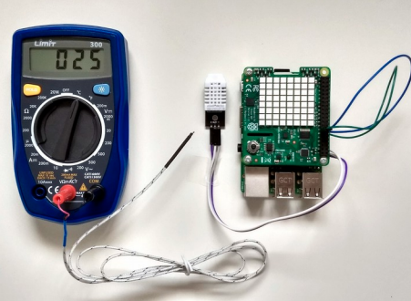
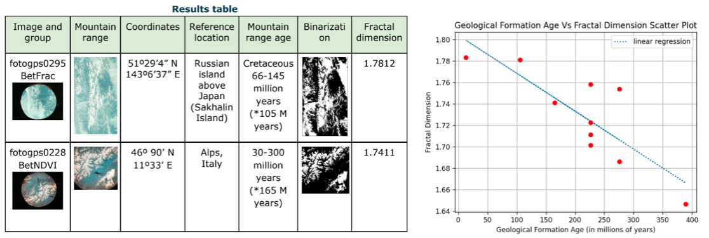

## Test and present your measurements

In this step, you will review methods to present your data and simulate your experiment on Earth. 

### Comparative testing

--- task ---

While you can't run your experiment in space at this stage, you should be able to find ways to test your hypothesis by simulating the environment or using other data sets for comparison. 

**Tip:** Make notes about any comparative testing you perform to include in your final report. 

A quote from a 2021/22 winner: "We decided to use Astro Pi pressure, humidity and temperature sensors to monitor the main ISS environmental parameters. We built greenhouses and a darkroom on Earth to simulate the conditions."

{:width="400px"}

--- /task ---

### Present your measurements

When you answer your research question, it is important to present your findings in a clear and concise way. Create charts and graphics to demonstrate your measurements and make your report more appealing and easy to understand for the judges. 

--- task ---

There are many ways to present your measurements. You could: 
+ Produce an altitude map
+ Create a scatter plotter
+ Chart data on a map
+ Review side-by-side images 
+ Overlay images
+ Make colourmaps

Or you could present your measurements in another way.  

Which technique will you use? 

--- /task ---
